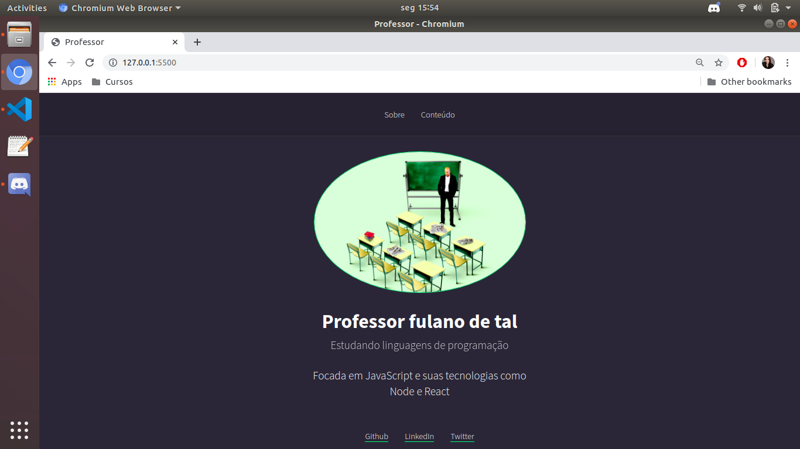
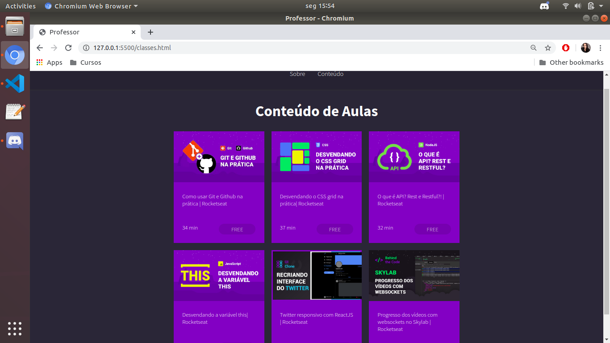
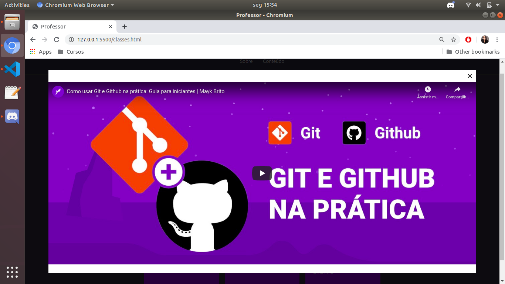

# Projeto de um portfolio básico 

## Descrição
Pequeno projeto, desenvolvido em HTML, CSS e JavaScript de um portfolio de um professor e seus conteúdos disponíveis para acesso online. 

Seu objetivo principal, é promover o aprendizado passo a passo de como desenvolver uma página web simples do zero. 

No arquivo css.md, você encontrará observações exclusivas sobre os comandos de css e suas funcionalidades (o que é cada coisa)

## Índice
- [Requisitos](#Requisitos)
- [Instalação](#Instalação)
- [Uso](#Uso)

## Requisitos
Não é obrigatório, mas para facilitar o uso, abri as paginas utilizando a extensão Live Server do VS Code. 

## Instalação
- No VS Code, na barra lateral esquerda, clicar em Extensions;
- Digitar Live Server;
- Baixar e deixar a mesma habiltada;

## Uso
Para rodar a aplicação:
- Abrir o arquivo index.html
- Com as teclas ctrl+shift+p , digitar Live Server: Open with live server
- Apertar a tecla enter.
- Após alguns instantes, deverá aparecer a seguinte tela:

### Tela inicial do projeto/ página sobre:

  

### Tela conteúdo:

  

### Modal do conteúdo:

  

